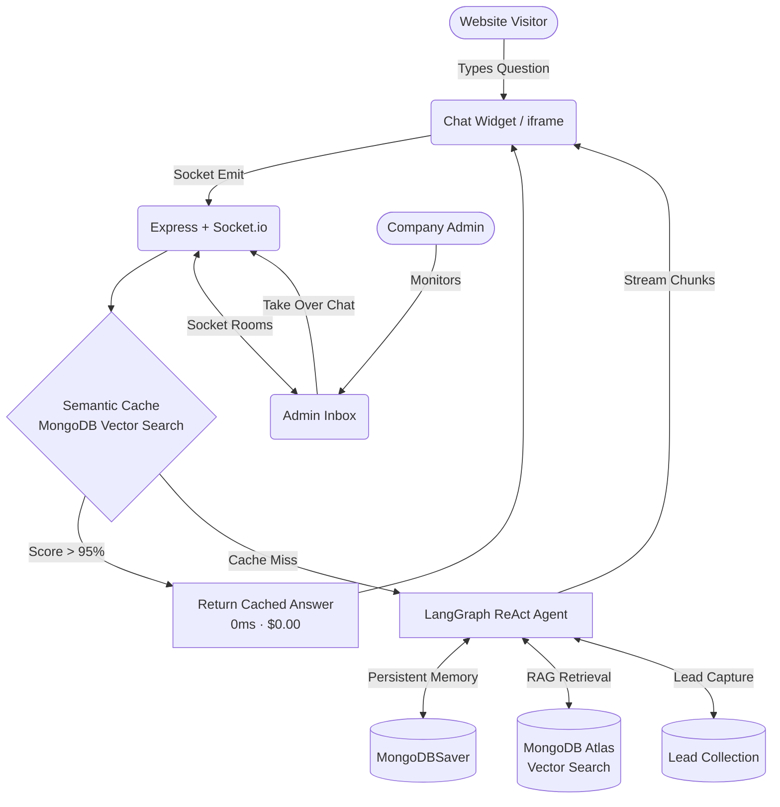

# 🤖 EmbedAI — Embeddable AI Customer Support SaaS

> **Multi-tenant, production-ready platform** to train AI agents on your knowledge base and embed them on any website with a single `<script>` tag.

[](https://github.com/yourusername/embedai/actions/workflows/ci.yml)
[](LICENSE)

---

## ✨ Features

| Feature | Details |
|---------|---------|
| 🧠 **Agentic RAG** | LangGraph-powered agent with autonomous tool calling — decides when to search KB, capture leads, or escalate |
| ⚡ **Semantic Caching** | MongoDB Vector Search intercepts repeated questions at >95% similarity — 0 LLM cost |
| 🤝 **Live Human Handoff** | Admins pause the AI and take over any conversation in real-time via Socket.io |
| 🔒 **Bank-Grade Auth** | Short-lived JWTs in memory + long-lived hashed HttpOnly refresh cookies + concurrent session limits + reuse detection |
| 🏢 **True Multi-Tenancy** | Metadata filtering at DB level — Tenant A's bot never sees Tenant B's documents |
| 🎙️ **Voice AI** | Browser Speech Recognition + Text-to-Speech built into the chat widget |
| 📊 **Real Analytics** | Queries per day, cache hit rate, and estimated cost savings — real MongoDB aggregation, not mock data |
| 📎 **One-Line Embed** | `<script src="https://api.embedai.com/api/bots/embed/{botId}"></script>` |

---

## 🏗️ Architecture



---

## 🛠️ Tech Stack

| Layer | Technology |
|-------|-----------|
| **Frontend** | React 19, TypeScript, Vite, Tailwind CSS v4 |
| **Backend** | Node.js, Express 5, TypeScript |
| **AI / LLM** | LangChain.js, LangGraph (ReAct agent), Google Gemini / OpenAI / Anthropic |
| **Database** | MongoDB Atlas (Vector Search, document storage) |
| **Real-time** | Socket.io |
| **Auth** | JWT (access 15m) + Hashed HttpOnly refresh cookies (7d) |
| **Observability** | Winston structured logging |
| **Infrastructure** | Docker, Docker Compose, GitHub Actions CI |

---

## 🚀 Quick Start

### One Command (Docker)

```bash
git clone https://github.com/yourusername/embedai.git && cd embedai

# 1. Configure backend secrets (see table below)
cp backend/.env.example backend/.env && nano backend/.env

# 2. Configure frontend URLs
cp frontend/.env.example frontend/.env.local

# 3. Start everything
docker compose up --build
```

Navigate to **http://localhost:80**

### Manual Setup

See [CONTRIBUTING.md](./CONTRIBUTING.md) for step-by-step local development setup.

---

## 🔐 Environment Variables

### Backend (`backend/.env`)

```bash
# Generate JWT secrets with:
# openssl rand -hex 64

PORT=5000
NODE_ENV=production
MONGO_URI=mongodb+srv://<user>:<password>@cluster.mongodb.net/embedai
FRONTEND_URL=https://app.yoursite.com
ALLOWED_ORIGINS=https://app.yoursite.com,https://www.yoursite.com

JWT_ACCESS_SECRET=<64-char-random-hex>
JWT_REFRESH_SECRET=<different-64-char-random-hex>

EMBEDDING_MODEL=gemini-embedding-001
GEMINI_MODEL=gemini-2.0-flash
```

### Frontend (`frontend/.env.local`)

```bash
VITE_API_URL=https://api.yoursite.com
VITE_SOCKET_URL=https://api.yoursite.com
```

---

## 🗄️ MongoDB Atlas Setup

### 1. Vector Search Index — `documentchunks` collection

Index name: `vector_index`

```json
{
  "fields": [
    {
      "numDimensions": 3072,
      "path": "embedding",
      "similarity": "cosine",
      "type": "vector"
    },
    {
      "path": "botId",
      "type": "filter"
    }
  ]
}
```

### 2. Semantic Cache Index — `semanticcaches` collection

Index name: `cache_vector_index`

```json
{
  "fields": [
    {
      "numDimensions": 3072,
      "path": "embedding",
      "similarity": "cosine",
      "type": "vector"
    },
    {
      "path": "botId",
      "type": "filter"
    }
  ]
}
```

### 3. LangGraph Checkpoints — `langgraph_checkpoints` collection

No special index required — automatically managed by `MongoDBSaver`.

---

## 🌐 Embedding the Widget

After creating your bot in the dashboard, go to **Install** tab and copy your embed snippet:

```html
<script src="https://api.yoursite.com/api/bots/embed/{YOUR_BOT_ID}"></script>
```

Paste it before the closing `</body>` tag on any website.

---

## 🛡️ Security Model

| Threat | Mitigation |
|--------|-----------|
| Unauthenticated API access | All admin routes require `requireAuth` + `requireBotOwnership` |
| Cross-tenant data leaks | `requireBotOwnership` middleware verifies `bot.tenantId === req.user.tenantId` |
| DB breach token replay | Refresh tokens stored as SHA-256 HMAC hashes, never plaintext |
| Token theft | Reuse of a revoked refresh token triggers revocation of ALL sessions for that user |
| File upload abuse | Multer limits: 10 MB max, PDF MIME type only |
| JSON payload DoS | `express.json({ limit: '1mb' })` |
| Brute force | `express-rate-limit` on auth routes (15 req/hr) |
| Socket flooding | Per-socket rate limiter (20 msg/min) |
| XSS via error messages | Internal errors sanitized before any client response |
| postMessage spoofing | Embed script validates `e.origin` against allowedOrigin |
| Weak secrets | Startup check warns if JWT secrets are default placeholder values |

---

## 📁 Project Structure

```
embedai/
├── .github/workflows/ci.yml   # GitHub Actions CI
├── docker-compose.yml
├── backend/
│   ├── Dockerfile
│   ├── .env.example
│   └── src/
│       ├── ai/agent.ts          # LangGraph agent, semantic cache, LRU caches
│       ├── config/
│       │   ├── db.ts            # MongoDB connection
│       │   └── logger.ts        # Winston structured logger
│       ├── controllers/         # Route handlers
│       ├── middlewares/
│       │   ├── auth.middleware.ts     # requireAuth, requireBotOwnership
│       │   ├── rate.middleware.ts     # express-rate-limit configs
│       │   └── validate.middleware.ts # Zod request validation factory
│       ├── models/              # Mongoose schemas (9 models)
│       ├── routes/              # Express router definitions
│       ├── services/            # Business logic layer (WIP)
│       ├── sockets/
│       │   └── chat.socket.ts   # Socket.io handlers with rate limiting
│       └── server.ts            # App bootstrap, global error handler
└── frontend/
    ├── Dockerfile
    ├── .env.example
    └── src/
        ├── components/
        │   ├── AdminDashboard.tsx  # Full admin UI (7 tabs)
        │   ├── Auth.tsx            # Login / Register
        │   └── ChatWidget.tsx      # Embeddable chat UI + voice AI
        ├── pages/LandingPage.tsx
        └── utils/api.ts            # fetchWithAuth with silent token refresh
```

---

## 🤝 Contributing

See [CONTRIBUTING.md](./CONTRIBUTING.md) for the full guide, branch conventions, and PR checklist.

---

## 📝 License

MIT © 2024
